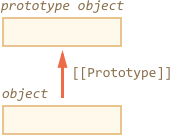
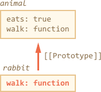

# Protitipsel Kalıtım

Programlarken genelde bir şeyi alır ve bunu genişletmek isteriz.

Örneğin, `kullanici` adında bir obje ve bunun özellikleri ve metodları olsun, bunu biraz düzenleyerek `admin` ve `misafir` gibi iki farklı obje oluşturmak isteriz. Yani `kullanici` objesini doğrudan kopyalamak veya metodlarını tekrardan uygulamak değil bunlar üzerinden yeni objeler yaratmak isteyebiliriz.

*Prototip kalıtımı* buna olanak sağlamaktadır.

[cut]

## [[Prototype]]

Javascript objeleri gizli bir özellik olan `[[Prototype]]` özelliğine sahiptirler. Bu `null` olabilir veya başka objeye referans verebilir.  Referans verilen obje "prototip" olarak adlandırılır.



`[[Prototip]]`'in "büyülü" bir anlamı bulunmaktadır. Objeden bir özellik okunmak istendiğinde, ve bu obje bulunamadığında JavaScript bunu otomatik olarak prototip'ten alır. Programlamada buna `prototip kalıtımı` denir. Birçok dil özelliği ve programlama tekniği bunun üzerine kuruludur.

`[[Prototpe]]` gizli bir özelliktir, fakat bunu ayarlamanın bir çok yolu vardır.

Bunlardan biri `__proto__` kullanmaktır:

```js run
let animal = {
  eats: true
};
let rabbit = {
  jumps: true
};

*!*
rabbit.__proto__ = animal;
*/!*
```

Aklınızda bulunsun `__proto__` `[[Prototype]]` ile *aynı değildir*. Bunun için alıcı/ayarlayıcı ( getter/setter)'dır. Bunun hakkında ilerleyen bölümlerde daha fazla açıklama yapılacaktır fakat şimdilik `__proto__` yeterlidir.

Örneğin `rabbit` adında bir özelliğe arasanız ve bu özellik yoksa, JavaScript bunu otomatik olarak `animal`'dan alır.

Örneğin:

```js run
let animal = {
  eats: true
};
let rabbit = {
  jumps: true
};

*!*
rabbit.__proto__ = animal; // (*)
*/!*

// Artık her ikisini de rabbit'te bulabilirsiniz.
*!*
alert( rabbit.eats ); // true (**)
*/!*
alert( rabbit.jumps ); // true
```

`(*)` satırında `animal`'ın `rabbit` in özleliği olması sağlanır

Sonrasında `alert` `rabbit.eats` `(**)`'i okur. Bu `rabbit`'te olmadığından JavaScript `[[Prototype]]`'ı takip eder ve bunu `animal`'in içerinde bulur.


Böylece "`animal`" `rabbit`'in prototip'i veya "`rabbit` prototipsel olarak `animal` kalıtımını almıştır" diyebiliriz.

Diyelim ki `animal`'ın birçok özelliği ve metodu olsun, bunları otomatik olarak `rabbit` de kullanabilir. Bu çeşit özelliklere `kalıtılmış` özellikler denir.

Eğer `animal`'da bir metodumuz varsa bu metod `rabbit` tarafından çağırılabilir olmaktadır.


```js run
let animal = {
  eats: true,
*!*
  walk() {
    alert("Animal walk");
  }
*/!*
};

let rabbit = {
  jumps: true,
  __proto__: animal
};

// walk prototipten alınmıştır.
*!*
rabbit.walk(); // Animal walk
*/!*
```
Metod prototipten otomatik olarak şu şekilde alınmıştır:


Prototip zinciri daha da uzun olabilir:


```js run
let animal = {
  eats: true,
  walk() {
    alert("Animal walk");
  }
};

let rabbit = {
  jumps: true,
  __proto__: animal
};

let longEar = {
  earLength: 10,
  __proto__: rabbit
}

// walk prorotip zincirinden alınmıştır.
longEar.walk(); // Animal walk
alert(longEar.jumps); // true (rabbit'ten gelmekte)
```


Aslında iki tane kısıtlama bulunmaktadır:


1. Referanslar kapalı devre olamaz. Böyle bir duurmda hata verir.
2. `__proto__`'nun değeri ya obje olur ya da `null` Diğer türlüsü ( tüm ilkel veri tipleri ) görmezden gelinir.

Çok açık olsa da tekrar söylemekte yarar var. Bir obje sadece bir tane `[[Prototype]]`'a sahip olabilir. Bir objenin iki farklı objeden kalıtım alamaz.

## Kuralların Okuması/Yazılması.


Prototip sadece özelliklerin okunması için kullanılır.

Veri özelliklerinin yazılma/silinme ( alıcı/ayarlayıcı değil) işi doğrudan obje üzerinden yapılır.


Aşağıdaki örnekte `rabbit`'e kendi `walk` metodu atanmıştır:

```js run
let animal = {
  eats: true,
  walk() {
    /* Bu metod rabbit tarafından kullanılmayacaktır. */  
  }
};

let rabbit = {
  __proto__: animal
}

*!*
rabbit.walk = function() {
  alert("Rabbit! Bounce-bounce!");
};
*/!*

rabbit.walk(); // Rabbit! Bounce-bounce!
```
Artık `rabbit.wal()` metodu doğrudan kendi içerisinde bulur ve çalıştırır. Prototip kullanmaz:



Alıcı/Ayarlayıcı için ise eğer özellik okunursa bu doğrudan prototipte okunur ve uyarılır.

Örneğin aşağıdaki `admin.fullName` özelliğine bakın:

```js run
let user = {
  name: "John",
  surname: "Smith",

  set fullName(value) {
    [this.name, this.surname] = value.split(" ");
  },

  get fullName() {
    return `${this.name} ${this.surname}`;
  }
};

let admin = {
  __proto__: user,
  isAdmin: true
};

alert(admin.fullName); // John Smith (*)

// Ayarlayıcılar uyarıldı!
admin.fullName = "Alice Cooper"; // (**)
```

`(*)` satırında `admin.fullName` özelliği `user` prototipinde alıcıya sahiptir. Bundan dolayı çağırılır. `(**)` satırında ise ayarlayıcıya sahip olduğundan bu da çağırılır.

## "this"'in değeri

Yukarıdaki örnekte aklınıza şöyle bir soru gelebilir. `set fullName(value)` içerisinde `this`'in değeri nedir? `this.name` ve `this.surname` yazılan yerlerde `admin` mi yoksa `user` mı kullanılır?

Cevap basittir: `this` prototip tarafından hiç bir şekilde etkilenmez.

**Metodun bulunduğu yerin önemi olmaksızın, metod çağrısında `this` her zaman noktadan önceki bölümdür.**

Öyleyese aslında ayarlayıcı `admin`'i `this` olarak kullanır. `user`'ı değil.

Çok büyük bir objeye ve buna ait birçok metoda, kalıtıma sahip olabileceğimizden dolayı bu aslında çok önemli bir olaydır.  Sonrasında büyük objenin değil kalıtılmış objelerin metodlarını çalıştırabilir ve bunların özelliklerini değiştirebiliriz.

Örneğin burada `animal` aslında "metod deposu"'nu temsil etmektedir. `rabbit` ise bunu kullanır.

`rabbit.sleep()` çağrısı `rabbit` üzerinde `this.isSleeping`'i ayarlar:

```js run
// animal metodları
let animal = {
  walk() {
    if (!this.isSleeping) {
      alert(`I walk`);
    }
  },
  sleep() {
    this.isSleeping = true;
  }
};

let rabbit = {
  name: "White Rabbit",
  __proto__: animal
};

// rabbit.isSleeping'i modifiye eder.
rabbit.sleep();

alert(rabbit.isSleeping); // true
alert(animal.isSleeping); // undefined (prototipte böyle bir özellik bulunmamaktadır.)
```
Sonuç görseli:


Eğer `bird`, `sname` gibi `animal`'dan miras alan objelere sahip olsaydık bunlar da `animal`'in metodlarına erişebilirlerdi. Fakat her metoddaki `this` bağlı bulunduğu objeye göre çalışırdı. Yani noktadan önceki metoda göre, `animal`'e göre değil. Bundan dolayı ne zaman `this`'e veri yazılsa o objelerin içerisine yazılır.

Sonuç olarak metodlar paylaşılsa bile objelerin durumları paylaşılmaz.

## Özet

- JavaScript'te tüm objelerin gizli `[[Prototype]]`'ı bulunmaktaıd. Bu özellik ya başka bir objedir veya `null`'dur.
- Erişmek için `obj.__proto__` kullanılabilir. (elbette diğer yollar da mevcuttur, ilerde bunlara değineceğiz.)
- `[[Prototype]]` tarafından temsil edilen objeye "prototip" denir.
- Eğer bir `obj`'nin özelliğini okumak veya bir metodunu çağırmak istersek ve o metod yok ise JavaScript bunu prototipte bulmaya çalışır. Yazma/Silme operasyonları doğrudan obje üzerinde çalıştırılır. Özellik ayarlayıcı olmadığı sürece prototip kullanılmaz.
- Eğer `obj.method()`'u çağırırsak ve `method` prototipten alınırsa `this` yine de `obj`'i temsil eder. Bundan dolayı metodlar her zaman o anki obje ile çalışırlar miras kalsalar bile.