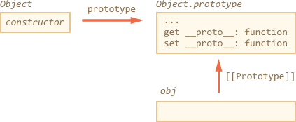
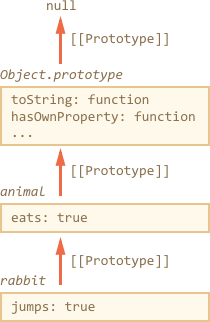

# Metodlar ve prototipler

Bu bölümde prototipler ile çalışmak için ek metodlardan bahsedeceğiz

Bizim bildiğimizin haricinde prototipi ayarlamak ve almak için başka yöntemler de bulunmaktadır:

- [Object.create(proto[, descriptors])](mdn:js/Object/create) -- verilen `proto`'yu `[[Prototype]]` şeklinde alarak ve opsiyonel tanımlayıcı özelliği kullanarak boş bir obje oluşturur.
- [Object.getPrototypeOf(obj)](mdn:js/Object.getPrototypeOf) -- `obj`'nin `[[Prototype]]`'ını döndürür.
- [Object.setPrototypeOf(obj, proto)](mdn:js/Object.setPrototypeOf) -- `obj`'nin `[[Prototype]]`'ını `proto`'ya ayarlar.

[cut]

Örneğin:

```js run
let animal = {
  eats: true
};

// animal prototipi ile yeni bir rabbit objesi yaratma.
*!*
let rabbit = Object.create(animal);
*/!*

alert(rabbit.eats); // true
*!*
alert(Object.getPrototypeOf(rabbit) === animal); // rabbit'in prototipini alma
*/!*

*!*
Object.setPrototypeOf(rabbit, {}); // rabbit'in prototipini {}'e çevirme.
*/!*
```
`Object.create` opsiyonel olarak ikinci bir argümana sahiptir: özellik tanımlayıcı. Aşağıdaki gibi yeni objeye özellikler ekleyebiliriz:

```js run
let animal = {
  eats: true
};

let rabbit = Object.create(animal, {
  jumps: {
    value: true
  }
});

alert(rabbit.jumps); // true
```
Tanımlayıcıların <info:property-descriptors> bölümünde üstünden geçilmiştir. Formatları aynıdır.
`Object.create` kullanarak obje klonlama işlemini yapabiliriz. Bu objenin özelliklerini `for..in` ile dolanmaktan daha etkin bir yöntemdir.

```js
// Objenin yüzeysel klonu
let clone = Object.create(Object.getPrototypeOf(obj), Object.getOwnPropertyDescriptors(obj));
```
Bu tam olarak `obj`'nin aynısını verir. Tüm özellikler: dönülebilir veya dönülemez, veri özellikleri, alıcı ve ayarlayıcılar --  herşey, ayrıca doğru `[[Prototype]]` ile

## Tarihçe

`[[Prototype]]`'ı ayarlayabileceğimiz yöntemleri saymaya kalsak baya zorluk yaşarız. Çok fazla yöntem bulunmaktadır.

Neden?

Birçok nedeni bulunmaktadır.

- Yapıcının `"prototype"` özelliği ilk javascript ortaya çıktığından beri bulunmaktadır.
- 2012'de: `Object.create` bir standart olarak oturdu. Bu verilen prototip ile objeleri yaratmaya izin verdi. Fakat bunları almaya veya ayarlamaya değil. Bundan dolayı tarayıcılar bir standart olmayan `__proto__` erişimcilerini uygulayarak alıcı ve ayarlayıcılara ( get/set)'e izin verdi.
- 2015'te: `Object.setPrototypeOf` ve `Object.getPrototypeOf` bir standart olarak eklendi. `__proto__` defakto şeklinde aslında her yerde kullanılmıştı, Bundan dolayı çokta kulllanılan özellikler olmadı, sadece tarayıcı harici çevrelerde kullanılır oldu.

Artık bunların hepsi bizim kullanımımızdadır.

Teknik olarak `[[Prototype]]`'ı istediğimiz an alma/ayarlama işi yapabiliriz. Fakat genelde bunu sadece obje yaratırken kullanır ve daha sonra düzenleme yapmayız: `rabbit`, `animal`dan kalıtım alır fakat onu değiştirmez. JavaScript motorları da bunu yüksek derecede optimize edebilir. Prototipi `Object.setPrototypeOf` veya `obj.__proto__` ile sonradan değiştirmek oldukça yavaş bir operasyondur. Ama mümkündür.

## "Very plain" objects

As we know, objects can be used as associative arrays to store key/value pairs.

...But if we try to store *user-provided* keys in it (for instance, a user-entered dictionary), we can see an interesting glitch: all keys work fine except `"__proto__"`.

Check out the example:

```js run
let obj = {};

let key = prompt("What's the key?", "__proto__");
obj[key] = "some value";

alert(obj[key]); // [object Object], not "some value"!
```

Here if the user types in `__proto__`, the assignment is ignored!

That shouldn't surprise us. The `__proto__` property is special: it must be either an object or `null`, a string can not become a prototype.

But we did not intend to implement such behavior, right? We want to store key/value pairs, and the key named `"__proto__"` was not properly saved. So that's a bug. Here the consequences are not terrible. But in other cases the prototype may indeed be changed, so the execution may go wrong in totally unexpected ways.

What's worst -- usually developers do not think about such possibility at all. That makes such bugs hard to notice and even turn them into vulnerabilities, especially when JavaScript is used on server-side.

Such thing happens only with `__proto__`. All other properties are "assignable" normally.

How to evade the problem?

First, we can just switch to using `Map`, then everything's fine.

But `Object` also can serve us well here, because language creators gave a thought to that problem long ago.

The `__proto__` is not a property of an object, but an accessor property of `Object.prototype`:



So, if `obj.__proto__` is read or assigned, the corresponding getter/setter is called from its prototype, and it gets/sets `[[Prototype]]`.

As it was said in the beginning: `__proto__` is a way to access `[[Prototype]]`, it is not `[[Prototype]]` itself.

Now, if we want to use an object as an associative array, we can do it with a little trick:

```js run
*!*
let obj = Object.create(null);
*/!*

let key = prompt("What's the key?", "__proto__");
obj[key] = "some value";

alert(obj[key]); // "some value"
```

`Object.create(null)` creates an empty object without a prototype (`[[Prototype]]` is `null`):


So, there is no inherited getter/setter for `__proto__`. Now it is processed as a regular data property, so the example above works right.

We can call such object "very plain" or "pure dictionary objects", because they are even simpler than regular plain object `{...}`.

A downside is that such objects lack any built-in object methods, e.g. `toString`:

```js run
*!*
let obj = Object.create(null);
*/!*

alert(obj); // Error (no toString)
```

...But that's usually fine for associative arrays.

Please note that most object-related methods are `Object.something(...)`, like `Object.keys(obj)` -- they are not in the prototype, so they will keep working on such objects:


```js run
let chineseDictionary = Object.create(null);
chineseDictionary.hello = "ni hao";
chineseDictionary.bye = "zai jian";

alert(Object.keys(chineseDictionary)); // hello,bye
```

## Getting all properties

There are many ways to get keys/values from an object.

We already know these ones:

- [Object.keys(obj)](mdn:js/Object/keys) / [Object.values(obj)](mdn:js/Object/values) / [Object.entries(obj)](mdn:js/Object/entries) -- returns an array of enumerable own string property names/values/key-value pairs. These methods only list *enumerable* properties, and those that have *strings as keys*.

If we want symbolic properties:

- [Object.getOwnPropertySymbols(obj)](mdn:js/Object/getOwnPropertySymbols) -- returns an array of all own symbolic property names.

If we want non-enumerable properties:

- [Object.getOwnPropertyNames(obj)](mdn:js/Object/getOwnPropertyNames) -- returns an array of all own string property names.

If we want *all* properties:

- [Reflect.ownKeys(obj)](mdn:js/Reflect/ownKeys) -- returns an array of all own property names.

These methods are a bit different about which properties they return, but all of them operate on the object itself. Properties from the prototype are not listed.

The `for..in` loop is different: it loops over inherited properties too.

For instance:

```js run
let animal = {
  eats: true
};

let rabbit = {
  jumps: true,
  __proto__: animal
};

*!*
// only own keys
alert(Object.keys(rabbit)); // jumps
*/!*

*!*
// inherited keys too
for(let prop in rabbit) alert(prop); // jumps, then eats
*/!*
```

If we want to distinguish inherited properties, there's a built-in method [obj.hasOwnProperty(key)](mdn:js/Object/hasOwnProperty): it returns `true` if `obj` has its own (not inherited) property named `key`.

So we can filter out inherited properties (or do something else with them):

```js run
let animal = {
  eats: true
};

let rabbit = {
  jumps: true,
  __proto__: animal
};

for(let prop in rabbit) {
  let isOwn = rabbit.hasOwnProperty(prop);
  alert(`${prop}: ${isOwn}`); // jumps:true, then eats:false
}
```
Here we have the following inheritance chain: `rabbit`, then `animal`, then `Object.prototype` (because `animal` is a literal object `{...}`, so it's by default), and then `null` above it:



Note, there's one funny thing. Where is the method `rabbit.hasOwnProperty` coming from? Looking at the chain we can see that the method is provided by `Object.prototype.hasOwnProperty`. In other words, it's inherited.

...But why `hasOwnProperty` does not appear in `for..in` loop, if it lists all inherited properties?  The answer is simple: it's not enumerable. Just like all other properties of `Object.prototype`. That's why they are not listed.

## Summary

Here's a brief list of methods we discussed in this chapter -- as a recap:

- [Object.create(proto[, descriptors])](mdn:js/Object/create) -- creates an empty object with given `proto` as `[[Prototype]]` (can be `null`) and optional property descriptors.
- [Object.getPrototypeOf(obj)](mdn:js/Object.getPrototypeOf) -- returns the `[[Prototype]]` of `obj` (same as `__proto__` getter).
- [Object.setPrototypeOf(obj, proto)](mdn:js/Object.setPrototypeOf) -- sets the `[[Prototype]]` of `obj` to `proto` (same as `__proto__` setter).
- [Object.keys(obj)](mdn:js/Object/keys) / [Object.values(obj)](mdn:js/Object/values) / [Object.entries(obj)](mdn:js/Object/entries) -- returns an array of enumerable own string property names/values/key-value pairs.
- [Object.getOwnPropertySymbols(obj)](mdn:js/Object/getOwnPropertySymbols) -- returns an array of all own symbolic property names.
- [Object.getOwnPropertyNames(obj)](mdn:js/Object/getOwnPropertyNames) -- returns an array of all own string property names.
- [Reflect.ownKeys(obj)](mdn:js/Reflect/ownKeys) -- returns an array of all own property names.
- [obj.hasOwnProperty(key)](mdn:js/Object/hasOwnProperty): it returns `true` if `obj` has its own (not inherited) property named `key`.

We also made it clear that `__proto__` is a getter/setter for `[[Prototype]]` and resides in `Object.prototype`, just as other methods.

We can create an object without a prototype by `Object.create(null)`. Such objects are used as "pure dictionaries", they have no issues with `"__proto__"` as the key.

All methods that return object properties (like `Object.keys` and others) -- return "own" properties. If we want inherited ones, then we can use `for..in`.
